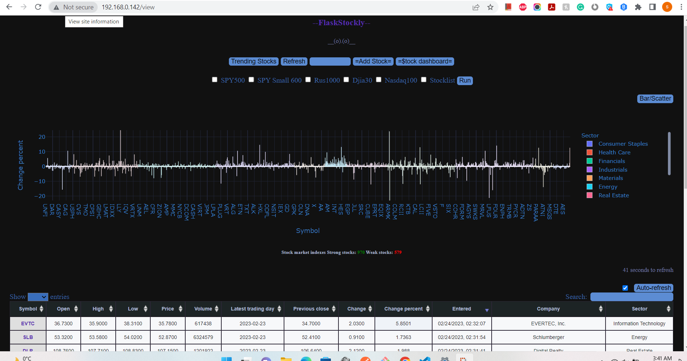

# Flaskstockly

Flaskstockly is a Flask web application that allows users to enter a stock symbol or run script (grab indexes) and retrieve information about the stock using the AlphaVantage API and yfinance library. The application also uses SQLite for storing the stock data, allowing for persistent data even after the application is closed. Pandas and Plotly are used for data handling and visualization, and the application has several routes that perform various tasks, such as displaying stock information, creating Plotly graphs, and continuously updating the stock data. Additionally, web scraping is used to provide trend information, which is displayed on a trend page with a Plotly graph.

# Installation

Before running the application, make sure to replace the 'API Key' in the Secapi.py file with your own free API from AlphaVantage or 'demo'. To install the required dependencies, open a command prompt and run the following command:

```bash
python -m pip install -r requirements.txt
```

To start the application, run the following command:

```bash
python main.py
```

Once the application is running, clicking on 'RUN' will start getting data from the API. Clicking on '$tock/Trend Dashboard' or 'Refresh' will show stocks data if any has been gathered. If no data is shown, click on 'RUN' again.


# Usage

Clicking on 'RUN' will slowly generate a searchable dataframe with functionalities such as sorting and filtering data:

[](http://www.youtube.com/watch?v=Axrrbg3YYGc "Experience the Power of FlaskStockly: The Ultimate Tool for Stock Analysis")


Enjoy!